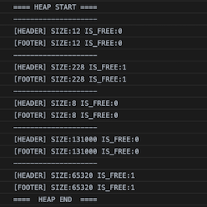
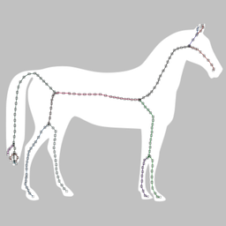
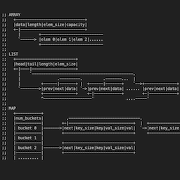

# wasm-fun

*Non-trivial programs in hand-written WebAssembly*

This repo is a collection of useful algorithms written from scratch in WebAssembly text format (`.wat`) and assembled to `.wasm` via [wabt](https://github.com/WebAssembly/wabt).

See [Overview](#Overview) section for a list of programs included. See [wat](wat/) folder for the fully-commented and well-explained source code. See [wasm](wasm/) for compiled binaries you can grab and use (with your JS projects). See [tests](tests/) for usage examples.

Despite that the algorithms are non-trivial, the assembled binaries are extremely small (compared to say what you get from emscripten)! Average file size is ~900 bytes.

## Motivation

I find WebAssembly a wonderful technology, and have been compiling C's and C++'s to wasm via emscripten for many projects. So I thought I should learn at least learn the "real" thing -- coding in WebAssembly directly. Fortunately, the lisp-like S-expressions makes the language quite pleasant to work with.

I haven't found many handwritten examples beyond the "fizzbuzz" and the "99 beers". (This [Conway's Game of Life in WebAssembly](https://blog.scottlogic.com/2018/04/26/webassembly-by-hand.html) gave me a lot of inspiration though). So I started my own little collection of algorithms I enjoyed, in hand-written WebAssembly, with ample comments and explanations for the reader.

I think WebAssembly is the sort of language where the beauty is derived from its simplicity. 

## Overview

|  | |
|---|---|
|  |  [**thinning.wat**](wat/thinning.wat) |
|  | Skeletonization/thinning of binary images. Implements Zhang-Suen (1984). [Paper](http://agcggs680.pbworks.com/f/Zhan-Suen_algorithm.pdf) |
|  |  [**disttransform.wat**](wat/disttransform.wat) |
|  | Compute distance transform of binary images. Implements Meijster distance. [Paper](http://fab.cba.mit.edu/classes/S62.12/docs/Meijster_distance.pdf) |
|  | [**findcontours.wat**](wat/findcontours.wat) |
|  | Trace contours from binary images (vector output). This is the same as OpenCV's `findContours`. Implements Suzuki-Abe (1983). [Paper](https://www.academia.edu/15495158/Topological_Structural_Analysis_of_Digitized_Binary_Images_by_Border_Following) |
|  |  [**browniantree.wat**](wat/browniantree.wat) |
|  | Generate brownian fractal trees (aka Diffusion-limited aggregation). |
|  |  [**mazegen.wat**](wat/mazegen.wat) |
|  | Generate mazes using Wilson's algorithm, which guarantees an unbiased sample from the uniform distribution over all mazes. |
|  |  [**malloc.wat**](wat/malloc.wat) |
|  | Very baseline 32-bit implicit-free-list first-fit malloc. |
|  |  [**traceskeleton.wat**](wat/traceskeleton.wat) |
|  | Retrieve topological skeleton as a set of polylines from binary images. [Original algorithm](https://github.com/LingDong-/skeleton-tracing). Includes a malloc implementation and a linked list implementation. ~300% faster than the version complied with emscripten (and ~10x smaller), ~500% faster than vanilla Javascript. |
|  |  [**containers.wat**](wat/containers.wat) |
|  | Implements STL-like polymorphic container types `arr<T>` (continous resizable array), `list<T>` (doubly linked list) and `map<T,T>` (hash table). |
